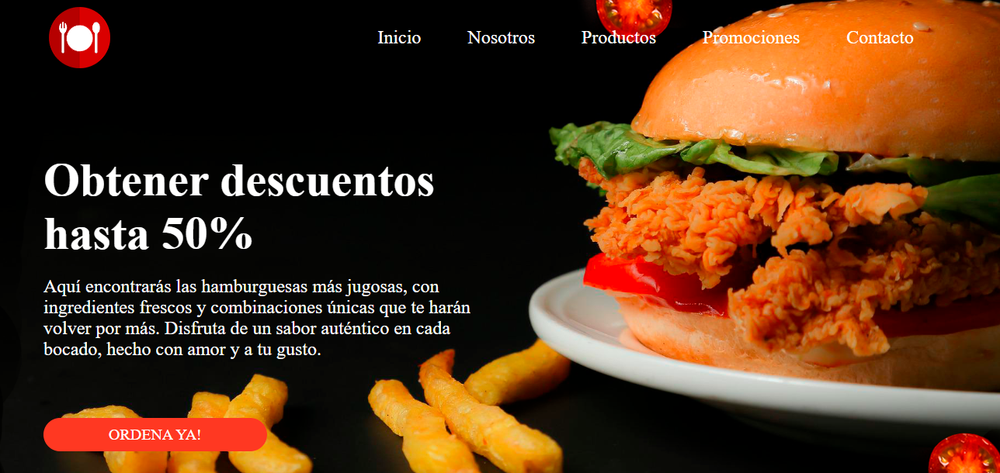

# 🍔 Burger House

**Burger House** es una página web diseñada para una hamburguesería moderna, donde se destacan sus productos, promociones y presencia en distintas ciudades. 
Su diseño atractivo y funcional ofrece una experiencia visual deliciosa al usuario.

## 📂 Estructura del Proyecto

```
BURGER-WEB/
│
├── css/
│ └── style.css # Estilos principales del sitio
│
├── img/ # Carpeta para las imágenes del sitio (hamburguesas, íconos, etc.)
│
└── index.html # Página principal del sitio
```


## 🖥️ Vista de Inicio

La página principal incluye:
- Menú de navegación (Inicio, Nosotros, Productos, Promociones, Contacto).
- Imagen destacada de hamburguesa con papas.
- Mensaje promocional con descuentos de hasta el 50%.
- Botón de llamada a la acción: “ORDENA YA”.




## 🚀 Tecnologías Utilizadas

- HTML5
- CSS3
- Diseño responsivo 
- Tipografía y colores modernos
  

## 📢 Características

- Sección de inicio llamativa con promociones.
- Espacios pensados para destacar productos como “La Mejor Burger” y “Burger Gigante”.
- Además secciones como estadísticas, suscripción y paquetes promocionales.
 

  ## 🌐 Despliegue

Este proyecto ha sido desplegado con **GitHub Pages**, una herramienta gratuita para alojar sitios web estáticos directamente desde un repositorio de GitHub.

🔗 Puedes ver el sitio en línea aquí:  
https://yasmintorresdesign.github.io/Burger-Web/


## ✍️ Autora

**Yasmin Torres**  

Diseñadora de productos industriales y desarrolladora web. 
Para más información o colaboraciones, puedes escribirme a:
📧 yatorres.73@gmail.com


